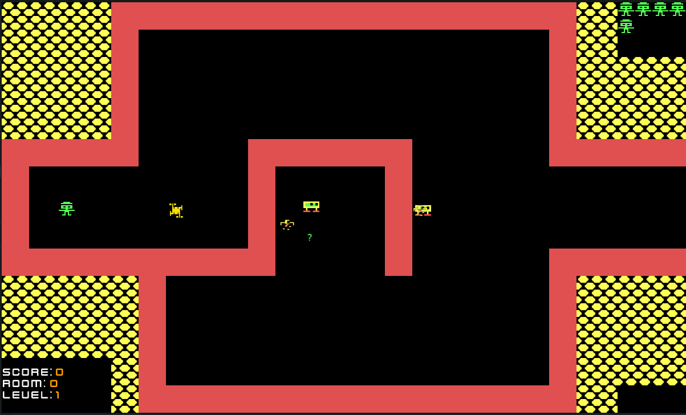

# Shamus
_Remake of the old DOS game "shamus" written in Rust_

Screenshot:


## Rooms and levels map:


Commands to build/run:

>_All commands execute from the parent folder (where the "Cargo.toml" file exists)_

To build: 
```shell
cargo build --release
```
>_do not forget to copy binary file next to the assets folder before execution_

To run: 
```shell
cargo run
```
## TODO list:
- [x] Shadow
- [x] End game
- [x] Player collision with walls
- [ ] Improve enemy moving
- [ ] Enemy shoots